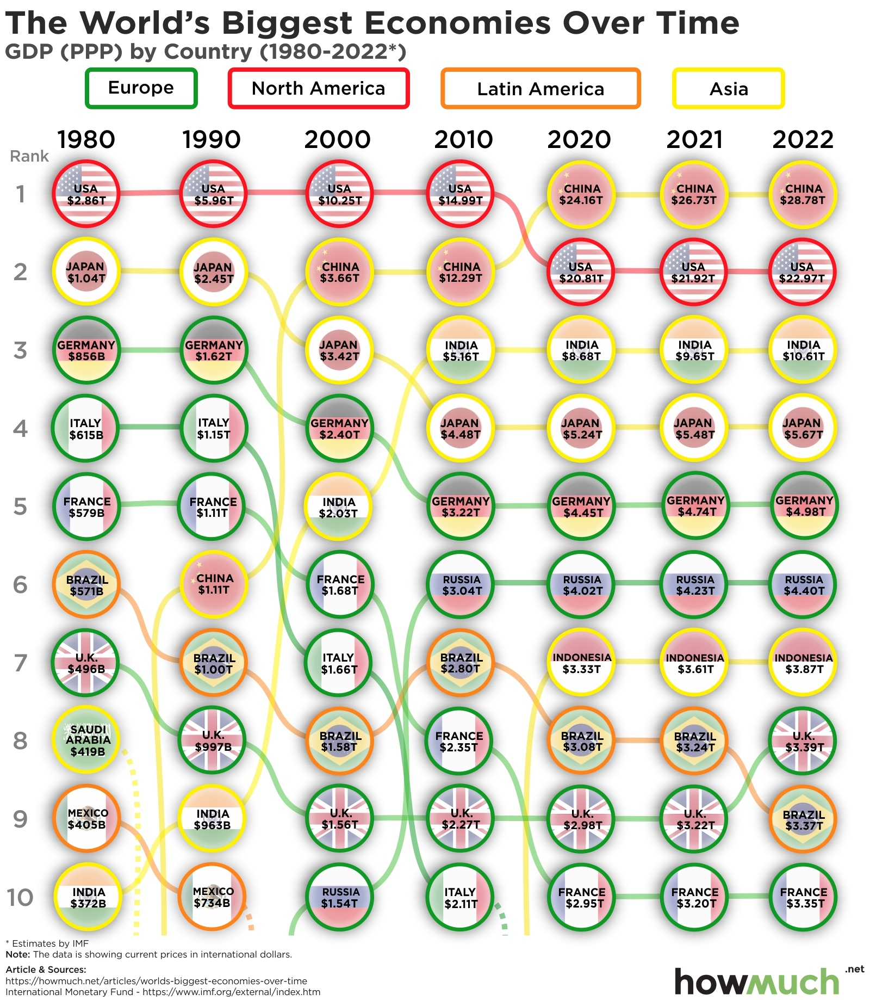

# largest-economies-information-visualization

A reproducible data-preparation workflow for a Tableau visualization redesign project based on the IMF World Economic Outlook dataset. The project focuses on historical GDP by country from 1980 to 2022, using the `PPPGDP` indicator (GDP at current prices, purchasing power parity, billions of international dollars). The broader goal is to critique and redesign an existing GDP-by-country infographic using data visualization principles drawn from Jonathan Schwabish, Edward Tufte, and Dunford's "When data visualization really isn't useful (and when it is)."

This repository does not claim authorship of the underlying IMF data. It only provides a documented, reproducible extraction and cleaning workflow for educational and visualization purposes.

---

## Project overview

The starting point is the IMF WEO Excel export (`WEOOct2025all.xlsx`), which is a wide-format spreadsheet with one column per year. The `extract_weo_pppgdp.py` script filters out the relevant indicator, reshapes the data into a tidy long-format table (one row per country-year), and saves the result as CSV and XLSX files ready to load into Tableau.

The cleaned data covers all IMF member countries for the years 1980–2022, with a separate file focusing on the seven benchmark years used in the infographic: 1980, 1990, 2000, 2010, 2020, 2021, and 2022.

---

## Motivation

The original infographic being redesigned presents the world's largest economies ranked by GDP over time, but it has several visual design problems — inconsistent scales, cluttered labels, and a layout that makes it hard to track individual countries across years. This project supplies a clean, well-structured dataset so that a Tableau redesign can focus entirely on visual design choices rather than data-wrangling.

The redesign draws on:
- **Jonathan Schwabish** — clear storytelling with data, reducing chart junk
- **Edward Tufte** — data-ink ratio, small multiples, sparklines

---

## Assignment context

This repository supports the course assignment to:

- select the "Largest Economies in the World Over the Last 40 Years" visualization,
- identify at least three major issues (with citations),
- redesign the visualization in Tableau, and
- document the critique and redesign in a Word document with screenshots.

The cleaned data here is the reproducible input to the Tableau redesign. The written critique, citations, and final screenshots are produced outside this repository.

---

## Source visualization

- Visualization: https://howmuch.net/articles/worlds-biggest-economies-over-time
- Underlying data: IMF WEO Excel export (`WEOOct2025all.xlsx`)

Original infographic (used as the baseline for critique and redesign):



---

## Indicator used

| IMF code | Full name | Unit |
|---|---|---|
| `PPPGDP` | GDP, current prices, purchasing power parity | Billions of international dollars |

PPP-adjusted GDP is used rather than nominal GDP because it allows more meaningful comparisons between countries at different price levels.

---

## Repository structure

```
largest-economies-information-visualization/
├── WEOOct2025all.xlsx          # Raw IMF WEO October 2025 spreadsheet export
├── extract_weo_pppgdp.py       # Pandas extraction and reshaping script
├── requirements.txt            # Python dependencies
├── .gitignore
├── output/                     # Generated by the script — not committed to git
│   ├── weo_pppgdp_1980_2022_long.csv
│   ├── weo_pppgdp_1980_2022_long.xlsx
│   ├── weo_pppgdp_infographic_years_long.csv
│   ├── weo_pppgdp_infographic_years_long.xlsx
│   ├── weo_pppgdp_infographic_years_top10.csv
│   └── weo_pppgdp_infographic_years_top10.xlsx
└── README.md
```

---

## How to run the script

Install dependencies (Python 3.8+ required):

```bash
pip install -r requirements.txt
```

Run the script from the repository root, where `WEOOct2025all.xlsx` lives:

```bash
python extract_weo_pppgdp.py
```

Output files will be written to the `output/` folder. The script prints a short log as it runs so you can verify each step completed.

---

## Output files

| File | Contents |
|---|---|
| `weo_pppgdp_1980_2022_long.csv` | All countries, every year 1980–2022, long format |
| `weo_pppgdp_1980_2022_long.xlsx` | Same, Excel format |
| `weo_pppgdp_infographic_years_long.csv` | All countries, benchmark years only (1980/1990/2000/2010/2020/2021/2022) |
| `weo_pppgdp_infographic_years_long.xlsx` | Same, Excel format |
| `weo_pppgdp_infographic_years_top10.csv` | Top 10 economies per benchmark year |
| `weo_pppgdp_infographic_years_top10.xlsx` | Same, Excel format |

**Start here in Tableau:** `weo_pppgdp_infographic_years_long.csv` — it is small, focused, and covers exactly the years used in the infographic.

---

## Output column reference

| Column | Description |
|---|---|
| `country_id` | IMF 3-letter country code (e.g. `USA`, `JPN`, `DEU`) |
| `country` | Full country name |
| `indicator_id` | Always `PPPGDP` in this dataset |
| `indicator` | Full indicator label from the IMF source |
| `scale` | Value scale (e.g. `Billions`) |
| `unit` | Currency unit (`International Dollars`) |
| `year` | Calendar year (integer) |
| `gdp_ppp_billions_intl_dollars` | PPP GDP value in billions of international dollars |

Example rows:

| country_id | country | indicator_id | year | gdp_ppp_billions_intl_dollars |
|---|---|---|---|---|
| USA | United States | PPPGDP | 1980 | 2857.325 |
| JPN | Japan | PPPGDP | 1980 | 1027.574 |
| DEU | Germany | PPPGDP | 1980 | 856.000 |

---

## Using the data in Tableau

1. Open Tableau Desktop and connect to a text file or Excel file.
2. Load `weo_pppgdp_infographic_years_long.csv`.
3. Set `year` to **Discrete** dimension (not continuous measure).
4. `gdp_ppp_billions_intl_dollars` is your primary measure.
5. `country` and `country_id` are your dimensions for color, labels, and filters.

This long format works directly with bump charts, slope charts, highlight tables, and small multiples — the main chart types suitable for a rank-over-time visualization.

---

## Data source and attribution

> International Monetary Fund. *World Economic Outlook Database*, October 2025 edition.
> Indicator: `PPPGDP` — GDP, current prices, purchasing power parity; billions of international dollars.
> Retrieved from: <https://www.imf.org/en/Publications/WEO>

The IMF data is publicly available and subject to the IMF's terms of use. This repository only contains a documented workflow for extracting and reshaping that data; it does not redistribute or modify the underlying values.

